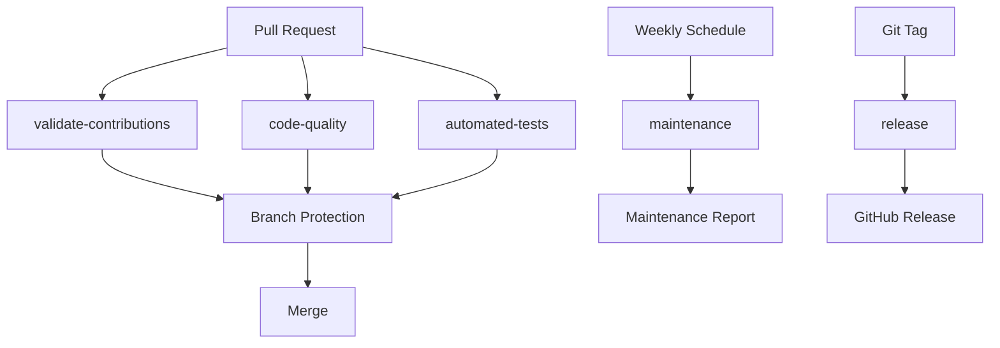

# GitHub Actions Workflows

This directory contains automated workflows that ensure code quality, data integrity, and project maintenance for the Book of Mormon Knowledge Graph.

## 🔍 Workflow Overview

### 1. **validate-contributions.yml**
**Purpose**: Validates all contributions to ensure data quality and integrity

**Triggers**: 
- Pull requests to main/master branches
- Pushes to main/master branches (when JSON/HTML files change)

**Jobs**:
- `validate-json`: Checks JSON structure and syntax
- `validate-references`: Validates scriptural references
- `validate-relationships`: Ensures valid relationship types
- `test-server`: Tests both Python and Node.js servers
- `generate-report`: Creates statistics and PR comments

### 2. **code-quality.yml**
**Purpose**: Ensures code quality and security

**Triggers**: 
- Pull requests to main/master branches
- Pushes to main/master branches

**Jobs**:
- `lint-python`: Code formatting and linting for Python files
- `lint-javascript`: ESLint checks for JavaScript files
- `validate-html`: HTML structure validation
- `security-scan`: Security vulnerability scanning
- `file-size-check`: Ensures files aren't too large
- `dependency-check`: Validates external dependencies

### 3. **automated-tests.yml**
**Purpose**: Comprehensive testing of functionality and compatibility

**Triggers**: 
- Pull requests to main/master branches
- Pushes to main/master branches

**Jobs**:
- `test-validation-script`: Tests the validation script
- `test-server-functionality`: Tests server endpoints and CORS
- `test-data-integrity`: Checks for orphaned edges and duplicates
- `test-browser-compatibility`: Tests with Playwright
- `performance-test`: Measures load times

### 4. **maintenance.yml**
**Purpose**: Weekly maintenance and monitoring

**Triggers**: 
- Weekly schedule (Sundays at 2 AM UTC)
- Manual trigger

**Jobs**:
- `check-dependencies`: Monitors Python and Node.js dependencies
- `check-external-dependencies`: Tests CDN availability
- `update-documentation`: Updates statistics and checks links
- `security-audit`: Comprehensive security review
- `create-maintenance-report`: Generates weekly reports

### 5. **setup-branch-protection.yml**
**Purpose**: Automatically sets up branch protection rules

**Triggers**: 
- Manual trigger only
- Pushes to main/master branches

**Jobs**:
- `setup-protection`: Configures branch protection with required checks

### 6. **release.yml**
**Purpose**: Automated release management

**Triggers**: 
- Git tags (v*)
- Manual trigger with version input

**Jobs**:
- `create-release`: Generates release notes and creates GitHub release
- `validate-release`: Tests release assets

## 🚀 Getting Started

### For Contributors
1. **Fork the repository**
2. **Make your changes**
3. **Push to your fork**
4. **Create a pull request**
5. **Wait for automated checks to pass**
6. **Address any issues if checks fail**

### For Maintainers
1. **Review pull requests**
2. **Ensure all checks pass**
3. **Merge approved PRs**
4. **Monitor maintenance reports**
5. **Create releases as needed**

## 🔧 Configuration

### Required Secrets
- `GITHUB_TOKEN`: Automatically provided by GitHub Actions

### Required Permissions
- `contents: write`: For creating releases and updating files
- `pull-requests: write`: For commenting on PRs
- `statuses: write`: For setting commit statuses

### Branch Protection
The workflows automatically set up branch protection rules that require:
- All validation checks to pass
- At least one approval
- Up-to-date branches
- No force pushes

## 📊 Monitoring

### Status Badges
Add these to your README to show workflow status:

```markdown


```

### Maintenance Reports
Weekly maintenance reports are automatically generated and can be found in:
- GitHub Actions logs
- Issues (if maintenance fails)
- Release notes

## 🛠️ Troubleshooting

### Common Issues

**Validation Failures**:
- Check JSON syntax
- Verify scriptural references
- Ensure valid relationship types

**Code Quality Issues**:
- Run `black` and `isort` for Python
- Fix ESLint errors for JavaScript
- Validate HTML structure

**Performance Issues**:
- Optimize large JSON files
- Check external dependencies
- Review server configuration

### Getting Help
- Check workflow logs for detailed error messages
- Review the validation script output
- Create an issue for persistent problems

## 🔄 Workflow Dependencies



## 📈 Metrics

The workflows track:
- **Validation Success Rate**: Percentage of PRs that pass validation
- **Code Quality Score**: Linting and security scan results
- **Performance Metrics**: Load times and browser compatibility
- **Dependency Health**: External service availability
- **Maintenance Status**: Weekly health checks

## 🎯 Future Enhancements

Potential improvements:
- **Automated Dependency Updates**: Dependabot integration
- **Performance Regression Testing**: Historical performance tracking
- **Accessibility Testing**: WCAG compliance checks
- **Internationalization**: Multi-language support validation
- **API Testing**: Automated API endpoint testing
